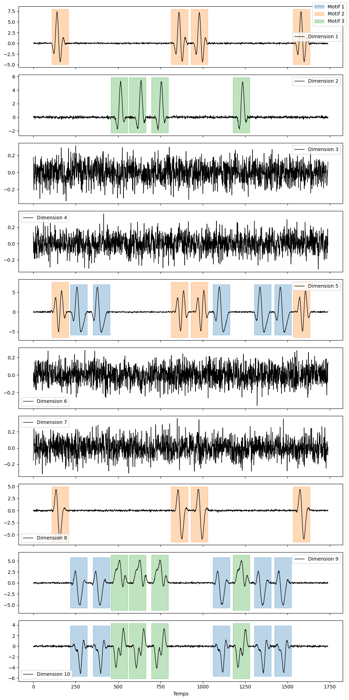

## CoordMotifs

### Data and experiments 

- Due to their large size, the  `data/` and `experiments/` directories are not included directly in this repository.
- Both directories are available for download:
  - **`data/`**: https://kiwi.cmla.ens-cachan.fr/index.php/s/3xYHLrWLjigiGbc
  - **`experiments/`**: https://kiwi.cmla.ens-cachan.fr/index.php/s/2XPPb6AwTJJr28p
- To reproduce the experiments, download both directories and place them in the **root directory of the `CoordMotifs` repository**.
- The expected directory structure is:

```text
CoordMotifs/
├── data/
├── experiments/
├── ...
└── README.md
```
## Usage

```python
from src.final_algo import CoordMotifs
from multivariate_tsmd.utils import plot_signal_and_submotifs
from multivariate_tsmd.new_multivariate_synthetic_signal import NewMultivariateSignalGenerator

# Generate synthetic signal
signal_gen = NewMultivariateSignalGenerator(n_motifs=3, n_d=10, n_actives_dimensions_ratio=0.3, motif_length=100)
signal, labels = signal_gen.generate()

# Initialize the method
cm = CoordMotifs(
    wlen = 100, n_patterns=3
)
# Discover coordinated motifs
cm.fit(signal)

# Plot the discovered motifs
plot_signal_and_submotifs(signal,cm.prediction_mask_, cm.prediction_dimension_)

```
<p align="center">
  
</p>